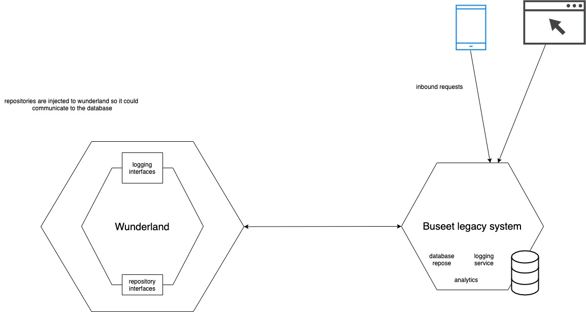

Buseet - The Wunderland
=======================

## Project scope 
Currently we have a live backend API for buseet and we're in a middle of an operation/process to refactor what we have 
as a multi-stage process.

Wunderland will contain all the logic needed


You can install the package via composer:

``` bash
composer require buseet/wunderland
```


## Architecture
Currently Wunderland follows hexagonal architecture. Meaning that if it needs to communicate
with any other external dependency(eg: database) it will define interfaces for it and the 
actual implementation for it will be in the legacy system. 
In other worlds, the goal is to make the legacy system serve as an application layer that has 
the integration to db connection/qyery, logging, analytics,..
Wunderland will hold all the business logic.
Mainly, Wunderland will be **a composer package** that is imported to the legacy system.

The diagram below will show you how this will work.



## Rollout
Wunderland production release will be handled as phased rollout.
Meaning that we'll rely on a feature-flag to enable the old system to start using wunderland.
This will make it easier for the development team to rollout/back any new integration.

For example: we might need to rollout wunderland to process the booking requests only.
We'll have a feature flag that will decide if this request could be processed by wunderland or
the legacy system.
Then we might allow the feature flag to enabled wunderland to serve 10% of the requests.
Then we monitor the requests if it went fine we keep increasing it. At some point we'll be sure that
wunderland is working as expected so Wunderland will be service 100% of the requests.

The diagram below will show you how this will work.


### Project name (Wunderland)
It was named after a German operation happened in the WWII.
In brief, Germans knew that soviet ships will need to hide.
Mainly soviet ships choose to hide near their ice breakers near the Arctic ocean.
The German fleet went there and found nothing, they never lost hope and kept looking and kept searching until they found
soviet ships, steamers and cargoes and they sunk them all.
Wunderland happened when the Germans were almost losing hope but it was amazing push against the allied troops.
